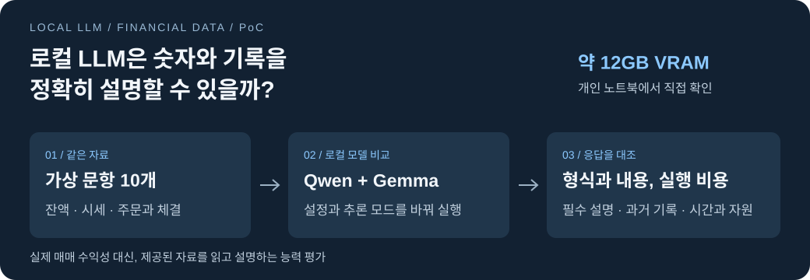
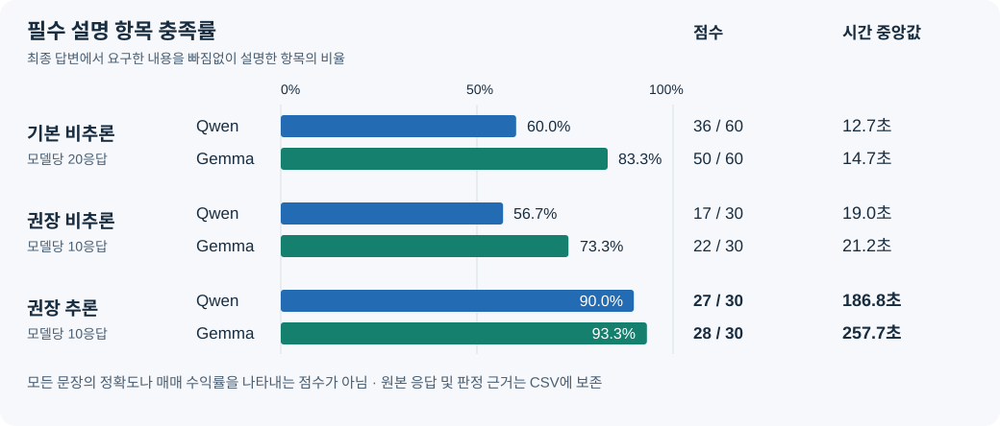
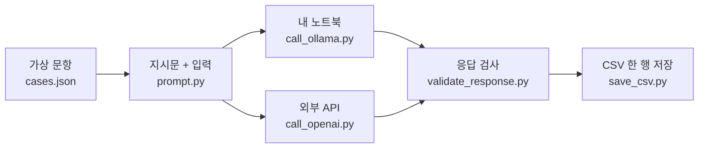
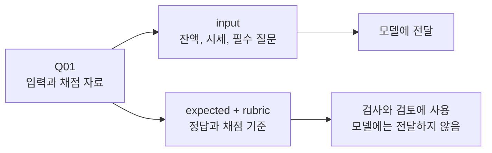
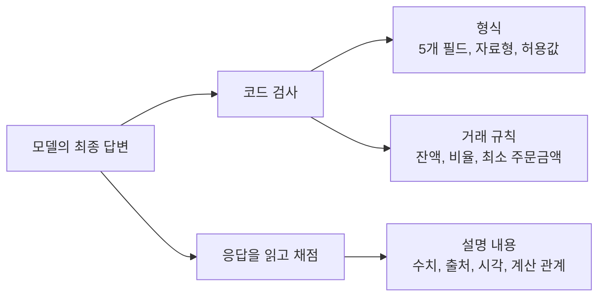
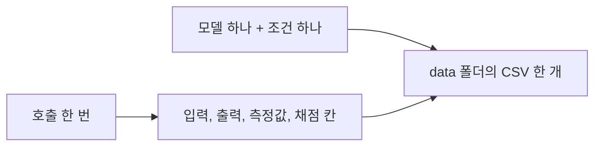

# local-llm-financial-data-poc



외부 LLM API가 하던 시장과 계좌 자료 해석을 개인 노트북으로 옮길 수 있을까? **주어진 수치와 과거 기록을 정확하게 설명하는지**부터 확인했다. 실제 주문과 매매 수익률은 평가하지 않았다.

[최종 보고서 읽기](reports/final_report.md) · [실험 집계표](reports/실험_집계.xlsx) · [응답과 채점 CSV](data/README.md)

## 먼저, 무엇을 발견했나?



**권장 설정의 추론에서 설명 충족률은 높아졌지만, 응답 시간도 길어졌다.** 300초 안에 지정 JSON을 반환한 횟수는 Qwen 10/10회, Gemma 6/10회였다. 이 시간 조건에서는 Qwen을 후속 검토 후보로 선택했다.

기본 비추론은 모델당 20응답, 권장 설정은 조건별 10응답이다. 점수는 필수 설명 항목의 충족률이며 모든 문장의 정확도를 뜻하지 않는다. 여러 설정과 반복 수가 달라 **추론 기능 하나의 효과나 실제 도입 가능성을 확정한 결과는 아니다.**

<details>
<summary>최종 답변이 나오지 않은 조건과 외부 API 비교</summary>

- **기본 설정 추론:** 생성 한도 2,048 또는 4,096에서 저장된 본 시험 43회 모두 최종 답변 미완료. 길이 제한 종료를 설명 내용 전체의 오류와 구분했다.
- **과거 기록 검토:** 권장 추론의 Q07~Q10 점수는 Qwen 10/12, Gemma 11/12. 전체 30점에 포함된 부분집계이다.
- **외부 API 비교:** OpenAI GPT-5.6 Luna 비추론에 공통 5문항을 한 번씩 제공해 15/15점, 평균 8.539초 기록. 로컬 전체 10문항과 같은 범위의 시험은 아니다.
- **남은 한계:** 두 로컬 모델 모두 설명 누락과 부가 오류가 남았으며, 권장 설정의 반복 검증도 부족하다. 실제 자동매매 도입은 보류했다.

Luna 5회 비용은 당시 사용량과 단가 기준 $0.00375315, 평균 $0.00075063/회이다. 같은 분량을 24시간, 30일 호출한다고 가정하면 30분 간격은 약 **$1.08**, 1시간 간격은 약 **$0.54**이다. 비추론 결과의 환산값이며 세금, 환율과 로컬 전기요금은 포함하지 않았다.

[Luna 호출 원본과 비용](data/gpt-5.6-luna_cloud-nonthinking-english_20260915-210424.csv) · [적용 단가와 계산 코드](modules/call_openai.py)

</details>

## 코드는 이 순서로 움직인다

`main.py`가 아래 순서를 관리한다. **한 번의 호출을 저장한 다음, 다음 문항으로 넘어간다.**



**로컬 경로는 Qwen 또는 Gemma, 외부 API 경로는 Luna를 호출한다.** 한 실행에서는 선택한 모델 하나만 사용한다. 로컬 실행이 외부 API를 자동으로 호출하지 않는다.

<details>
<summary>각 파일과 함수가 하는 일</summary>

| 읽는 순서 | 파일 | 핵심 역할 |
| --- | --- | --- |
| 1 | [main.py](main.py) | `main()`에서 옵션 해석, `run_trial()`에서 호출·검사·저장 순서 관리 |
| 2 | [cases.json](modules/cases.json) | 가상 입력과 평가용 정답, 문항별 세 가지 채점 기준 |
| 3 | [prompt.py](modules/prompt.py) | `build_messages()`로 공통 지시문과 현재 입력 구성 |
| 4 | [call_ollama.py](modules/call_ollama.py) | 로컬 응답 수신, 시간과 GPU 관측, 호출 후 모델 해제 |
| 4 | [call_openai.py](modules/call_openai.py) | 외부 API 응답 수신, 시간과 사용량 기록, 비용 계산 |
| 5 | [validate_response.py](modules/validate_response.py) | JSON 스키마 제공, 반환 형식과 계산 가능한 거래 규칙 검사 |
| 6 | [save_csv.py](modules/save_csv.py) | 입력을 개별 열로 분리하고 호출 결과를 한 행으로 저장 |

`main.py`에서는 **맨 아래 실행 시작 부분 → `main()` → `run_trial()`** 순서로 읽으면 된다.

| main.py의 함수 | 역할 |
| --- | --- |
| `load_cases()` | 문항 파일 읽기, 중복 및 채점 근거 경로 검사 |
| `trial_settings()` | 모델과 시험 조건에 맞는 실행 설정 구성 |
| `_prepare_trial()` | 문항, 설정, 모델 설치 상태 또는 API 키 설정 확인 |
| `_call_arguments()` | 현재 입력과 출력 스키마, 생성 설정을 호출 인자로 연결 |
| `run_trial()` | 문항 반복, 호출, 자동 검사와 CSV 저장 |
| `main()` | 터미널 옵션 해석과 실험 시작 |

현재 모델 입력은 `case["input"]`이다. 이후 실제 수집 자료를 사용하려면 같은 입력 구조로 변환해 `build_messages()`에 전달할 수 있다. 현재 프로그램에 실시간 수집이나 주문 기능은 없다.

</details>

## Q01 하나만 따라가 보기

**현금 100만 원, BTC 0개인 가상 계좌**를 모델에 제공한다. 5분봉 종가는 1억 원, EMA는 9,900만 원이다.



이 문항에서는 **잔액 구분**, **종가와 EMA의 비교 및 마감 시각**, **이전 결정·주문·체결의 유무**를 설명하도록 요구한다.

<details>
<summary>Q01에 실제로 들어가는 값과 출력 형식</summary>

| 입력 | 실제 값 |
| --- | --- |
| 기준 시각 | 2026-09-15 01:00 UTC |
| 가용 현금 / 묶인 현금 | 1,000,000원 / 0원 |
| 가용 BTC / 묶인 BTC | 0 BTC / 0 BTC |
| 5분봉 종가 / EMA | 100,000,000원 / 99,000,000원 |
| 5분봉 마감 시각 | 2026-09-15 01:00 UTC |
| 매수호가 / 매도호가 | 100,000,000원 / 100,100,000원 |
| 공포탐욕지수 | 68, Greed — 고정된 보조값 |
| 이전 결정 / 주문 / 체결 | 모두 없음 |
| 가상 수수료율 / 최소 주문금액 | 0.05% / 5,000원 |

위 표는 일부 입력을 발췌한 것이다. 시간봉과 일봉, 자료의 한계 안내 등 전체 원문은 [cases.json](modules/cases.json)에 있다. EMA는 제공된 비교값이며, 지표 계산이나 공포탐욕지수의 예측력은 시험하지 않았다.

`prompt.py`는 공통 지시문을 `system` 메시지에, 현재 문항의 `input`을 JSON 문자열로 바꾸어 `user` 메시지에 넣는다. 각 요청은 이전 대화를 이어받지 않는다.

출력은 다음 다섯 필드이다. 아래는 **구조 설명용 예시이며 실제 모델 응답이나 Q01 정답이 아니다.**

```json
{
  "decision": "hold",
  "buy_allocation_percentage": 0,
  "sell_allocation_percentage": 0,
  "reason": "Explain the required facts using the supplied sources.",
  "reflection_log": "Check prior decisions against orders and actual fills."
}
```

`decision`은 buy, sell, hold 중 하나이다. 비율은 0~100의 숫자이며 보류는 둘 다 0이다. 매수 또는 매도라면 해당 방향의 비율만 양수여야 한다. `reason`과 `reflection_log`는 비어 있지 않은 영어 문자열을 요구한다.

필수 세 항목은 이 두 설명 필드에 포함된 **최종 답변**을 보고 평가한다. 추론 원문에만 있는 내용으로 설명 누락을 보충하지 않는다.

</details>

## JSON이 맞아도 설명은 틀릴 수 있다



문항마다 요구한 **3개 항목을 각각 1점 또는 0점**으로 평가한다. 필요한 설명을 모두 포함하면 1점, 틀리거나 일부를 빠뜨리면 0점이다. Q07~Q10의 과거 기록 검토 점수는 전체 점수에 포함된다.

<details>
<summary>누가 채점했으며, 통과 기준은 무엇인가?</summary>

형식과 거래 규칙은 코드로 검사했다. 설명의 의미는 Codex가 입력 원문과 계산 결과에 대조해 판정했으며, 독립된 사람의 교차 검토를 수행한 결과는 아니다. CSV에 기대 설명, 응답 인용과 한국어 판정 근거를 보존했다. 새 호출의 설명 점수와 근거는 공란으로 두어 직접 검토할 수 있게 했다.

사전에 정한 모델별 20회 평가 기준은 다음과 같다.

- 300초 이내 지정 JSON 반환: **19/20회 이상**
- 필수 설명 항목 충족: **54/60점 이상**
- 확인 가능한 최종 결정의 중대한 거래 제한 위반: **0건**

권장 설정은 모델과 모드별 10회만 실행했으므로 위의 20회 기준을 그대로 통과했다고 표현하지 않는다. 점수가 90% 이상이어도 반복 검증과 남은 오류를 별도로 확인해야 한다.

시간 초과나 최종 답변 미완료는 0/3점으로 기록하되 내용 오류와 구분한다. 최종 결정을 해석할 수 없으면 거래 제한 판정은 불가이다. 아직 채점하지 않은 응답은 0점으로 바꾸지 않고 공란을 유지한다.

</details>

## 결과는 어디에 남나?



**CSV 한 행이 호출 한 번이다.** 파일명은 `모델명_시험명_날짜시간.csv`의 영어 표기이며, 시각은 한국 시간이다. [실험별 CSV 목록과 열 설명](data/README.md)에서 실제 응답을 확인할 수 있다.

<details>
<summary>CSV를 읽고 직접 채점하는 방법</summary>

| 확인할 내용 | 열 이름 |
| --- | --- |
| 공통 지시문과 입력 | `system_instruction`, `input_*` |
| 모델의 최종 답변 | `decision`, 두 비율 필드, `reason`, `reflection_log` |
| 추론 및 해석하지 못한 응답 | `thinking`, `unparsed_response` |
| 요청 설정 | `num_ctx`, `num_predict`, `think`, `temperature` 등 |
| 측정값 | `input_tokens`, `generated_tokens`, `wall_seconds`, `gpu_peak_mib`, `cost_usd` 등 |
| 자동 검사 결과 | `json_valid`, `trading_valid`, `json_within_300_seconds` |
| 설명 채점 | `review_1_*`~`review_3_*`, 총점 `score` |

각 채점 항목에는 기대 설명, 입력 경로, 판정, 점수, 응답 인용과 판정 이유를 기록한다. `pass`는 1점, `partial`과 `fail`은 0점이다. 총점 `score`도 직접 작성하며 자동 합산하지 않는다.

입력 JSON은 키 경로별 열로 나눈다. 예를 들어 첫 일봉 종가는 `input_market_input_ohlcv_day_1_close`이다. 30,000자가 넘는 긴 문자열만 같은 행의 `*_part_2` 등으로 나누며, 원래 필드와 순서대로 이어 붙이면 전체 내용이다.

열 이름은 영어, 입력과 응답 및 한국어 채점 근거는 원문을 유지한다. 공란 측정값은 0이 아니라 미측정 또는 해당 없음이다. 새로운 호출 결과는 CSV에만 저장하며, 과거 SQLite는 증빙으로 남아 있을 뿐 현재 실행에는 사용하지 않는다.

보존된 기록은 24개 CSV의 153개 시도, 151개 호출 원본과 채점이 있는 147개 결과이다. 핵심 결과 그림은 그중 영문 본 시험의 비교 결과이다.

</details>

## 직접 한 문항 실행하기

저장소 루트의 PowerShell에서 실행한다. Python 3.12, uv와 실행 중인 Ollama 서버가 필요하다.

```powershell
uv sync --frozen --python 3.12
ollama pull qwen3.5:9b
uv run --frozen python main.py --model qwen3.5:9b --condition basic-nonthinking --cases Q01 --repeat 1
```

실제 로컬 모델을 한 번 호출하며, 응답 검사와 `data` 폴더의 CSV 저장까지 수행한다. **설명 내용의 점수는 CSV에서 별도로 작성한다.**

<details>
<summary>다른 모델, 전체 문항과 외부 API 실행</summary>

```powershell
# Gemma 설치
ollama pull gemma4:12b

# Qwen 권장 비추론: 영문 10문항, 각 1회
uv run --frozen python main.py --model qwen3.5:9b --condition recommended-nonthinking

# Gemma 권장 추론: 영문 10문항, 각 1회
uv run --frozen python main.py --model gemma4:12b --condition recommended-thinking

# 기본 비추론: 영문 10문항, 각 2회
uv run --frozen python main.py --model qwen3.5:9b --condition basic-nonthinking

# 기본 추론: 생성 한도 4,096, 영문 10문항, 각 1회
uv run --frozen python main.py --model gemma4:12b --condition basic-thinking --num-predict 4096 --repeat 1

# 한국어 Q03, Q06, Q10: 각 2회, 별도 CSV
uv run --frozen python main.py --model qwen3.5:9b --condition basic-nonthinking --language ko

# W00 워밍업: 본 시험과 별도 CSV
uv run --frozen python main.py --model qwen3.5:9b --condition recommended-thinking --cases W00
```

`--cases`, `--repeat`, `--num-ctx`, `--num-predict`, `--timeout`으로 조건을 지정하고, `--output-dir`로 저장 폴더를 바꿀 수 있다. 기본 저장 위치는 현재 실행 폴더의 `data`이다. W00과 본 시험 문항은 한 CSV에 섞지 않는다.

외부 API는 `.env`에 개인 `OPENAI_API_KEY`를 설정한 다음 아래 명령으로 별도 실행한다. Q01, Q03, Q06, Q08, Q10을 각 한 번 **유료 호출**한다.

```powershell
uv run --frozen python main.py --model gpt-5.6-luna --condition cloud
```

같은 이름의 CSV가 이미 있으면 덮어쓰지 않고 호출 전에 중단한다. 저장 실패, 모델 해제 실패와 특정 API 접근 오류에서도 후속 호출을 중단하며 자동 재시도하지 않는다. CSV 편집과 채점은 실행 종료 후 진행한다. 새 실행은 새 파일이며 중단된 파일을 자동으로 이어서 실행하지 않는다.

</details>

<details>
<summary>노트북 사양, 후보 선정과 실제 실행 설정</summary>

약 12GB VRAM에서 실행할 수 있는 양자화 배포와 Ollama 지원을 먼저 확인한 뒤, 공개 지능 점수와 지시 준수, 긴 자료 활용 지표를 참고했다. 서로 다른 계열의 **Qwen/Qwen3.5-9B**와 **google/gemma-4-12B-it**을 후보로 선택했다.

| 환경 | 내용 |
| --- | --- |
| 장비 | ASUS ROG Zephyrus G14 GA403WR, Windows 11 Home 빌드 26200 |
| CPU / RAM | AMD Ryzen AI 9 HX 370, 12코어 24스레드 / 64GB |
| GPU | NVIDIA GeForce RTX 5070 Ti Laptop GPU, 조회 용량 12,227MiB |
| 실행 도구 | Python 3.12.13, Ollama 0.33.3 |
| 태그 / 양자화 | `qwen3.5:9b`, `gemma4:12b` / Q4_K_M |
| 패키지 버전 | [uv.lock](uv.lock)에 고정 |

| 실행 조건 | 문맥 창 | 생성 한도 | temperature / top_p / top_k | 관측 제한 |
| --- | ---: | ---: | --- | ---: |
| 기본 비추론, 두 모델 | 8,192 | 2,048 | 0 / 0.95 / 40 | 300초 |
| 기본 추론, 두 모델 | 8,192 | 2,048 또는 4,096 | 0 / 0.95 / 40 | 300초 |
| 권장 비추론, Qwen | 131,072 | 32,768 | 0.7 / 0.8 / 20 | 1,800초 |
| 권장 추론, Qwen | 131,072 | 32,768 | 1.0 / 0.95 / 20 | 1,800초 |
| 권장 비추론 및 추론, Gemma | 32,768 | 16,384 | 1.0 / 0.95 / 64 | 1,800초 |

공통 seed 42, min_p 0, repeat_penalty 1, frequency_penalty 0이다. presence_penalty는 권장 Qwen에서 1.5, 나머지는 0이다. 기본 설정은 실험자가 정한 공통 설정이며 Ollama 기본값이라는 뜻은 아니다.

Qwen은 일반 과제의 권장 샘플링과 생성 한도, Serving의 문맥 안내를 적용했다. Gemma의 문맥과 생성 한도는 실행자가 지정했다. 1,800초는 답변 완료 관찰용이며 300초 이내 응답 요구와 구분한다. 코드의 `recommended`는 시험 당시 설정을 재사용하는 이름으로, 최신 문서를 자동 반영하지 않는다.

모델은 하나씩 적재하고 호출 후 해제했다. 전체 응답 시간에는 로딩과 입력 처리, 추론 및 최종 답변 생성이 포함된다. GPU 전체 메모리는 `nvidia-smi`로 약 1초 간격 관측하고, 응답 후 Ollama의 모델 적재량과 구분했다. Qwen 권장 설정에서는 일부 CPU 분산 적재가 관측됐다.

[공개 모델 평가](https://artificialanalysis.ai/models/open-source/small) · [Qwen 공식 문서](https://huggingface.co/Qwen/Qwen3.5-9B#best-practices) · [Gemma 공식 문서](https://ai.google.dev/gemma/docs/core/model_card_4#best-practices)

</details>

---

**결론:** 이 노트북에서 답변 생성은 가능했지만, JSON 반환만으로 자료 해석의 정확성을 보장할 수는 없었다. 실행 설정, 최종 답변의 누락과 오류, 응답 시간 및 자원 사용량을 함께 확인해야 한다.

[전체 결과와 한계는 최종 보고서에서 확인하기 →](reports/final_report.md)
